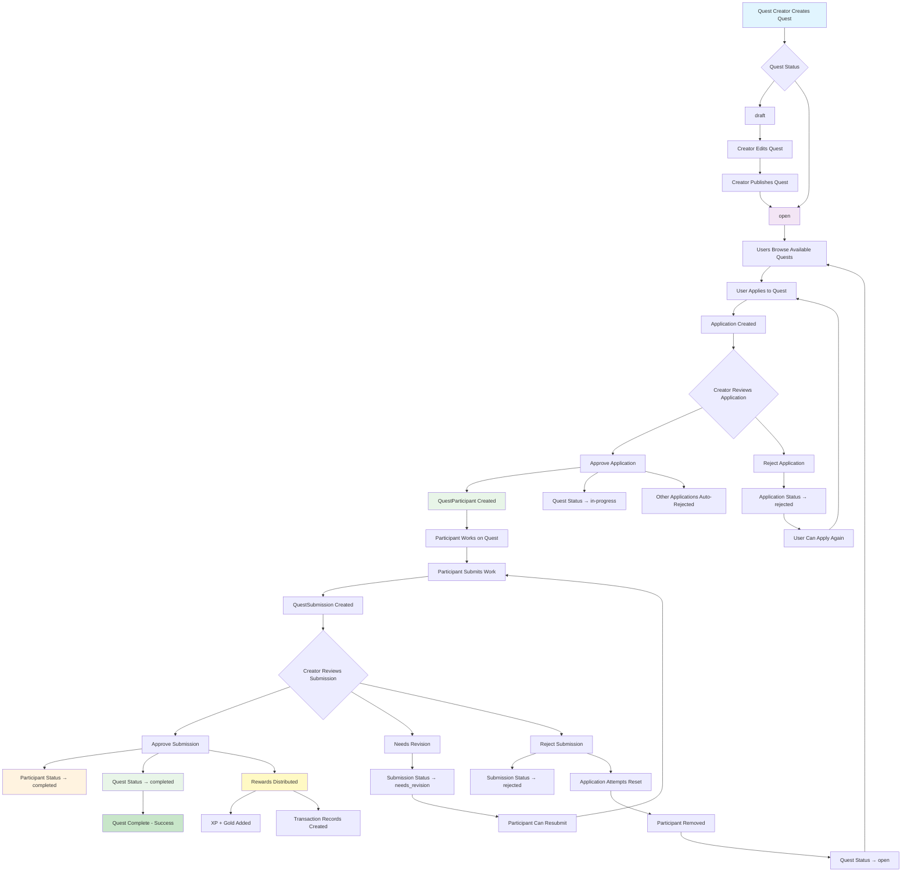
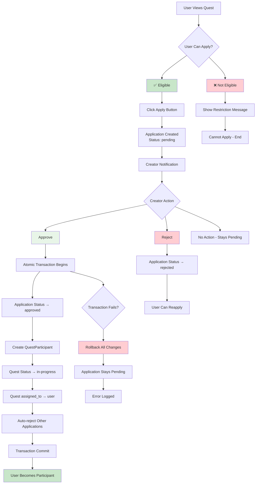
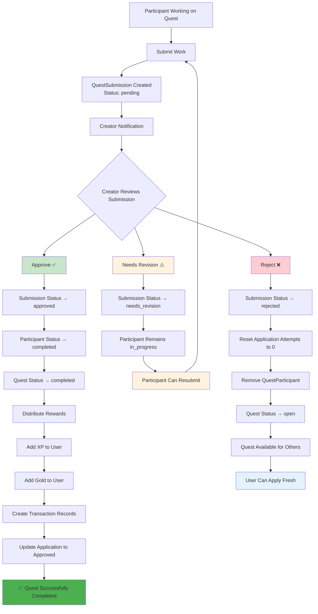
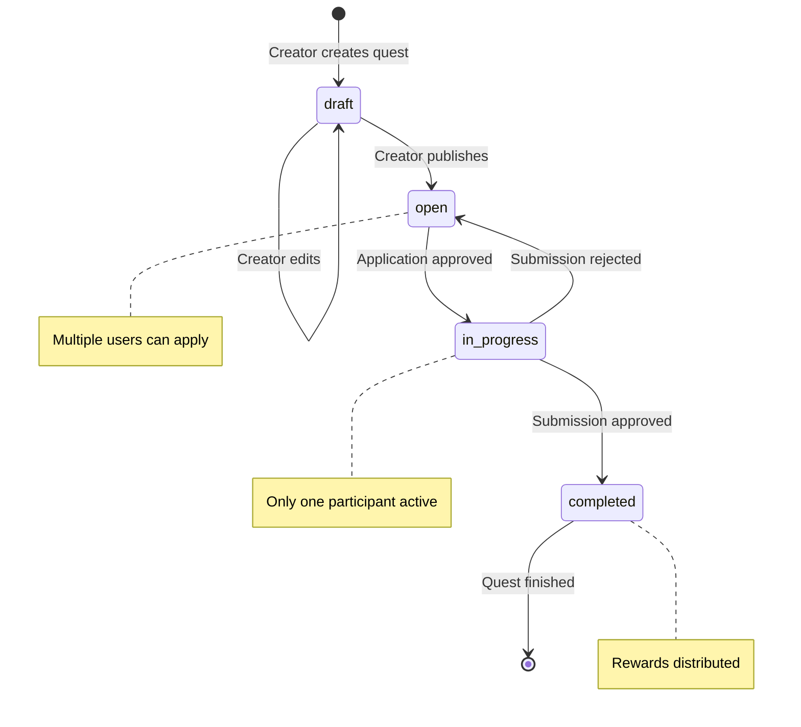

# Quest System Flowchart

## Complete Quest Lifecycle Flow



## Quest Application Process



## Quest Submission & Review Process



## Payment & Gold System Integration

```mermaid
flowchart TD
    A[User Wants Gold] --> B[Select Gold Package]
    B --> C[Generate QR Code]
    C --> D[User Pays via GCash]
    D --> E[User Uploads Receipt]
    
    E --> F[Payment Status: queued]
    F --> G[Assigned to Batch]
    G --> H{Batch Processing Time}
    
    H --> I[Admin Reviews Batch]
    I --> J{Payment Verification}
    
    J --> K[✅ Verified]
    J --> L[❌ Rejected]
    
    K --> M[Payment Status: verified]
    M --> N[Add Gold to User Account]
    N --> O[Create Transaction Record]
    O --> P[Payment Status: completed]
    
    L --> Q[Payment Status: rejected]
    Q --> R[User Can Resubmit]
    
    P --> S[User Can Use Gold for:]
    S --> T[Creating Quests<br/>(Quest Rewards)]
    S --> U[Cashout to Real Money]
    
    T --> V[Quest Created with Gold Rewards]
    V --> W[Participants Complete Quest]
    W --> X[Gold Transferred from Creator to Participant]
    
    U --> Y[Cashout Request]
    Y --> Z[KYC Verification]
    Z --> AA[Admin Approval]
    AA --> BB[Real Money Transfer]
    BB --> CC[Gold Deducted from Account]
    
    style K fill:#c8e6c9
    style L fill:#ffcdd2
    style P fill:#4caf50
    style X fill:#fff9c4
    style BB fill:#e8f5e8
```

## Quest Status State Machine



## Key System Components

### 1. **Quest Management**
- **Creation**: Draft → Open → In-Progress → Completed
- **Applications**: User applies → Creator reviews → Approve/Reject
- **Restrictions**: XP requirements, Gold requirements, Max attempts

### 2. **Submission System**
- **Independent Submissions**: Each submission reviewed separately
- **Three Review Actions**: Approve, Needs Revision, Reject
- **Attempt Management**: Reset on rejection, preserve on revision

### 3. **Reward Distribution**
- **Automatic**: Triggered on submission approval
- **XP Rewards**: Added to user profile
- **Gold Rewards**: Transferred from creator to participant
- **Transaction Logging**: All transfers recorded

### 4. **Security Features**
- **Atomic Transactions**: All-or-nothing application approval
- **Permission Checks**: Only quest creators can review
- **Attempt Limits**: Prevent spam applications
- **KYC Requirements**: For large cashouts

### 5. **Payment Integration**
- **Batch Processing**: Efficient payment verification
- **Multiple Methods**: GCash, PayMaya, Bank transfers
- **Commission Tracking**: Fee calculation and storage
- **Real-time Status**: Users track payment progress

## Business Logic Rules

### Quest Application Rules:
1. User must meet XP requirements
2. User must have sufficient gold (if required)
3. User cannot exceed max attempts
4. Only one participant per quest
5. Creator cannot apply to own quest

### Submission Review Rules:
1. Only quest creators can review submissions
2. Only pending submissions can be reviewed
3. Approval completes the quest immediately
4. Rejection resets all attempts for fresh start
5. Needs revision preserves progress

### Reward Distribution Rules:
1. Rewards only distributed on submission approval
2. Gold transferred from creator to participant
3. XP added directly to participant account
4. Commission fees deducted from transactions
5. All transfers create audit trail

### Payment Processing Rules:
1. All payments queued in batches
2. Small amounts (≤₱70) auto-approved
3. Large amounts require manual verification
4. KYC required for cashouts >₱500
5. Commission rates apply to all transactions

## Error Handling & Recovery

### Application Approval Failures:
- Automatic rollback of all changes
- Application status reverted to pending
- Detailed error logging
- User notified of system error

### Payment Processing Failures:
- Batch processing can be retried
- Individual payments can be re-verified
- Failed payments marked for manual review
- Users notified of status changes

### Data Consistency:
- Database constraints prevent orphaned records
- Foreign key relationships enforced
- Transaction atomicity guaranteed
- Audit trails for all critical operations
